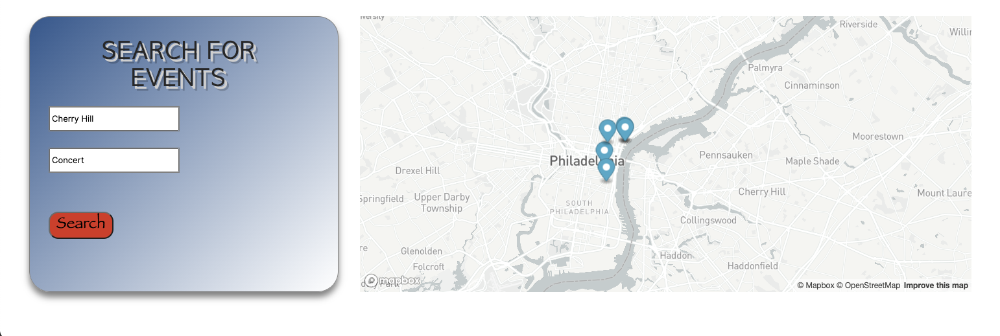
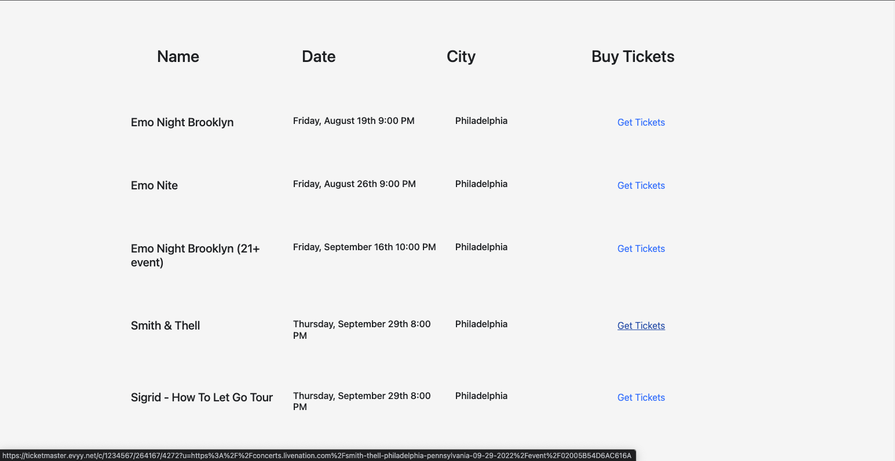

# ideal-event-master

## Description
Event Master is an all-inclusive website through which individuals can easily search for events occuring near them. Once a user types in a zipcode or city name, a map displays events using pins. In addition, a list of events appears underneath. Users also have the option to filter results based on what type of event they are looking for. 

The search results are displayed using information from user input and by pulling data via the Ticketmaster API and Mapbox API. The functions run once the search button is clicked.

## Screenshots

## Links
<a href="https://hasnafar.github.io/ideal-event-master/" target="_blank">Deployed Application</a>
<a href="https://github.com/hasnafar/ideal-event-master" target="_blank">GitHub Repository</a>