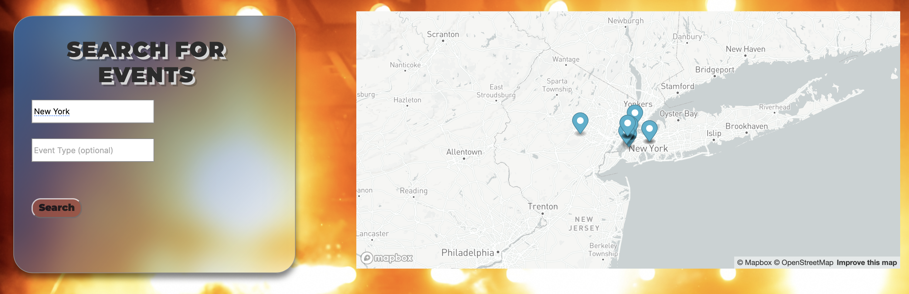
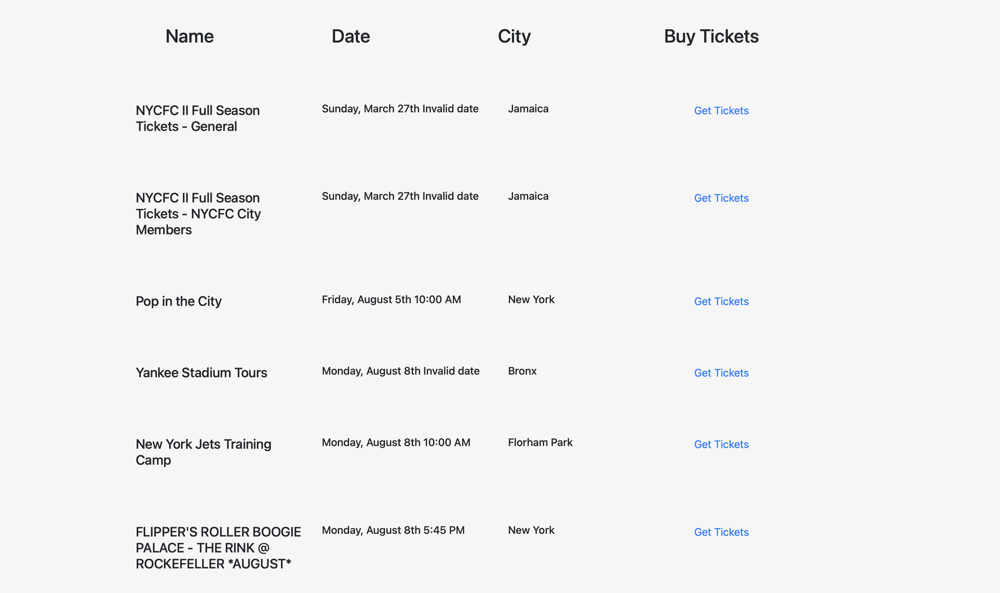

# ideal-event-master

## Description
Event Master is an all-inclusive website through which individuals can easily search for events occurring near them. When a user loads the website, pictures of events and a search box appear. Once a user types in a zip-code or city name, a map displays events using pins. In addition, a list of events appears underneath. This list includes the event name, date, time, location, and link to purchase tickets. Users also have the option to filter results based on what type of event they are looking for.

The search results are displayed using information from user input and by pulling data via the Ticketmaster API and Mapbox API. Moment.js is used for formatting the date. Google fonts are used to style the titles. The functions run once the search button is clicked. 

## Screenshots

## Links
<a href="https://hasnafar.github.io/ideal-event-master/" target="_blank">Deployed Application</a>
<a href="https://github.com/hasnafar/ideal-event-master" target="_blank">GitHub Repository</a>
<a href="https://docs.google.com/presentation/d/1GkHvUCBwLksDfhesH4CW1rFFaghjbTyhl_Jy21H7kG8/edit#slide=id.p" target="_blank">Presentation Link</a>

